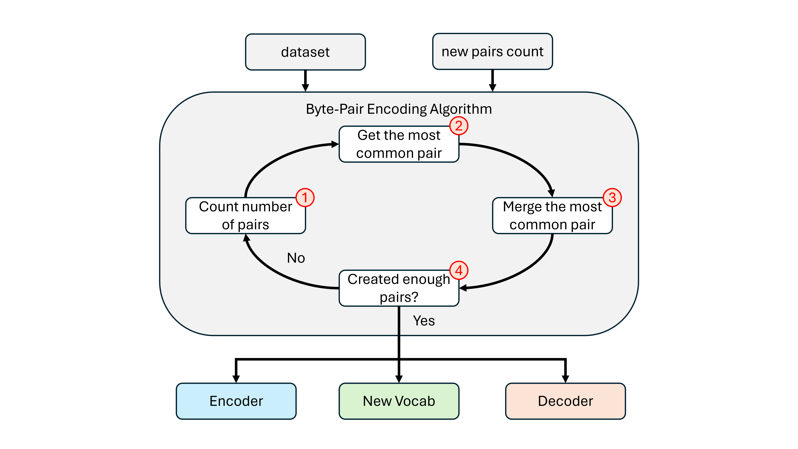

# Tokenization
Machines cannot directly understand human language. To them, only numbers carry meaning. **Tokenization** is the process that bridges this gap, transforming our words into a format machines can process. Just as translation maps words from one language to another, tokenization translates text from human-readable language into **tokens** - units that may represent individual characters, subwords, or entire words. Unlike raw text, these tokens are represented as numerical values, making them accessible to machines that otherwise cannot interpret our letters and symbols.

In this section, we will explore the details of **Byte-Pair Encoding (BPE) tokenization** and implement it step by step in Python. For hands-on experimentation, a dedicated Jupyter notebook has been prepared, which you can access and try out [here](/development/tokenization_test.ipynb).

## Overview of the Byte-Pair Encoding Method:
When it comes to tokenization, there are several approaches, each with its own trade-offs. At one extreme, we can tokenize at the character level. At the other, we can tokenize entire words. Modern approaches often strike a balance in between, using subwords through a technique called **Byte-Pair Encoding (BPE)**. Below are the pros and cons of each method:

#### Character-Based Encoding
- **Pros:** Extremely easy to implement and results in a very small vocabulary size.  
- **Cons:** Since the tokens are so limited, each text expands into many tokens, which reduces the effective context length.

#### Word-Based Encoding
- **Pros:** Encodings are longer and more complex, which increases the effective context size.  
- **Cons:** Vocabulary size can grow astronomically and still fail to include every possible word or variation.

#### Byte-Pair Encoding (BPE)
- **Pros:** Provides a balanced compromise between vocabulary size and context length.  
- **Cons:** More challenging to implement compared to the other two methods, and often confusing for beginners.

Now that we understand the options and their trade-offs, we will introduce the overall workflow of **Byte-Pair Encoding** before jumping into the actual implementation. The diagram below illustrates the process:

<!-- <p align="center">
  
</p> -->


## Implementation
Here is how we can implement the tokenizer module. The following code has implemented everything we just discussed. It is important to keep in mind that in order to generate a good tokenizer, we need a sample text that represents the data we want the model to work with. Once that data is provided, we can simply call the `generate_vocab` method within the class, which updates the vocab with however many new pairs we need, additionally, we can adjust the number of new pairs to be added to the tokenizer by simply adjusting the `self.max_vocab_size`. The difference between `self.max_vocab_size` and `self.base_vocab_size` will be the number of new tokens.
```python
########################################################################################################################
## -- libraries and packages -- ########################################################################################
########################################################################################################################
import os
import pickle

########################################################################################################################
## -- tokenizer training, encoder, and decoder -- ######################################################################
########################################################################################################################
class Tokenizer():
  def __init__(self, text_data = None):
    super(Tokenizer, self).__init__()
    self.new_merged_indexes = None
    self.text_data = text_data
    self.string_encoding = "utf-8"
    self.save_state_path = None
    self.base_vocab_size = 256
    self.max_vocab_size = 256
    self.vocab = None

  def get_base_tokens(self, text_data):
    text_data = text_data.encode(self.string_encoding)
    return list(map(int, text_data))

  def get_counts(self, indexes):
    counter_obj = {}
    for pair in zip(indexes[:-1], indexes[1:]):
      counter_obj[pair] = counter_obj.get(pair, 0) + 1
    return counter_obj
  
  def get_most_common_pair(self, counter_obj):
    return max(counter_obj, key = counter_obj.get)
  
  def merge_to_new_index(self, indexes, pattern, new_index):
    new_index_list, skip_flag = [], False
    for i in range(len(indexes) - 1):
      if skip_flag == False and indexes[i] == pattern[0] and indexes[i + 1] == pattern[1]:
        new_index_list.append(new_index)
        skip_flag = True
      else:
        if skip_flag == False:
          new_index_list.append(indexes[i])
        skip_flag = False
    new_index_list.append(indexes[-1]) if skip_flag == False else None
    return new_index_list
  
  def generate_vocab(self, save_state = True):
    base_tokens = self.get_base_tokens(self.text_data)
    base_counts = self.get_counts(base_tokens)
    self.vocab = {index:bytes([index]) for index in range(self.base_vocab_size)}
    self.new_merged_indexes = {}

    for i in range(self.base_vocab_size, self.max_vocab_size):
      most_common_pair = self.get_most_common_pair(base_counts)
      base_tokens = self.merge_to_new_index(base_tokens, most_common_pair, i)
      self.new_merged_indexes[most_common_pair] = i
      base_counts = self.get_counts(base_tokens)

    for (t0, t1), index in self.new_merged_indexes.items():
      self.vocab[index] = self.vocab[t0] + self.vocab[t1]

    if save_state:
      self.save_state(path = self.save_state_path)

    return
  
  def save_state(self, path = None):
    if path is None:
      path = "../data/vocab/tokenizer_state.pkl"
      os.makedirs(os.path.dirname(path), exist_ok = True)
      
    state_object = {
      "string_encoding": self.string_encoding,
      "base_vocab_size": self.base_vocab_size,
      "max_vocab_size": self.max_vocab_size,
      "new_merged_indexes": self.new_merged_indexes,
      "vocab": self.vocab
    }

    with open(path, "wb") as file:
      pickle.dump(state_object, file)

    return

  def load_state(self, path):
    with open(path, "rb") as file:
      state_object = pickle.load(file)

    self.string_encoding = state_object["string_encoding"]
    self.base_vocab_size = state_object["base_vocab_size"]
    self.max_vocab_size = state_object["max_vocab_size"]
    self.new_merged_indexes = state_object["new_merged_indexes"]
    self.vocab = state_object["vocab"]
    return

  def encoder(self, text):
    tokens = list(text.encode(self.string_encoding))
    while len(tokens) >= 2:
      counts = self.get_counts(tokens)
      replacement_pair = min(counts, key = lambda x: self.new_merged_indexes.get(x, float("inf")))
      if replacement_pair not in self.new_merged_indexes:
        break
      tokens = self.merge_to_new_index(tokens, replacement_pair, self.new_merged_indexes[replacement_pair])
    return tokens

  def decoder(self, tokens):
    return b''.join(self.vocab[token] for token in tokens).decode(self.string_encoding, errors = "replace")
```

An entire notebook is dedicated to run and test the tokenizer module we just designed, you may find it usefull. Click [here](/development/tokenization_test.ipynb) to check out that notebook.

## Navigation Panel
Use this navigation panel to move forward or backward through the tutorial, or jump straight to the homepage whenever you like.<br>
[Proceed to the next section: Data Handler](/documentation/markdowns/data_handler.md)<br>
[Return to the previous section: Tools](/documentation/markdowns/tools.md)<br>
[Back to the table of contents](/)<br>